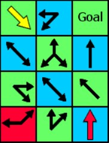

# CSC263-PS3

This repository contains coding components for a CSC263 problem set.

An Alice Maze is a logic puzzle created by Robbert Abbott. You can read more about his work here: https://www.logicmazes.com/

In this puzzle, the goal is to navigate along the squares in the specified directions to real the goal, but there are two rules.

Whenever you land on a square with red arrows, your step size increments, allowing you to jump over squares.

Similarily, when you land on a square with yellow arrows, your step size decrements.

The program Alice.py can solve such a maze in the fewest possible steps very efficiently.

This is achieved by a modified version of the breadth first search algorithm.
